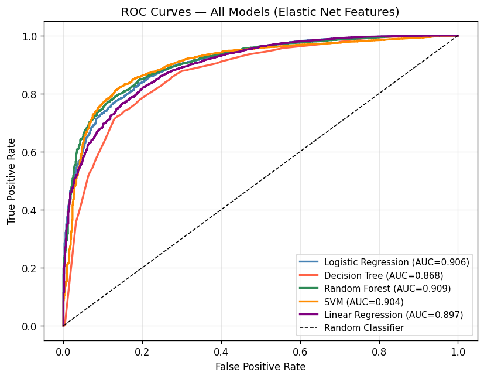
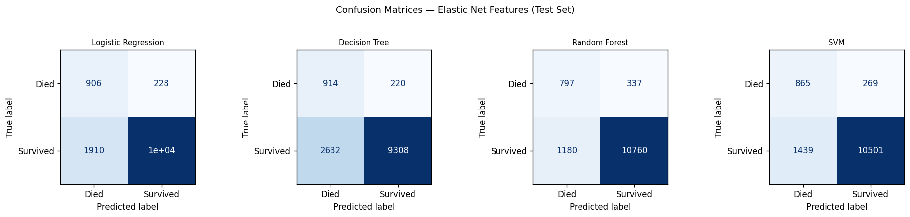
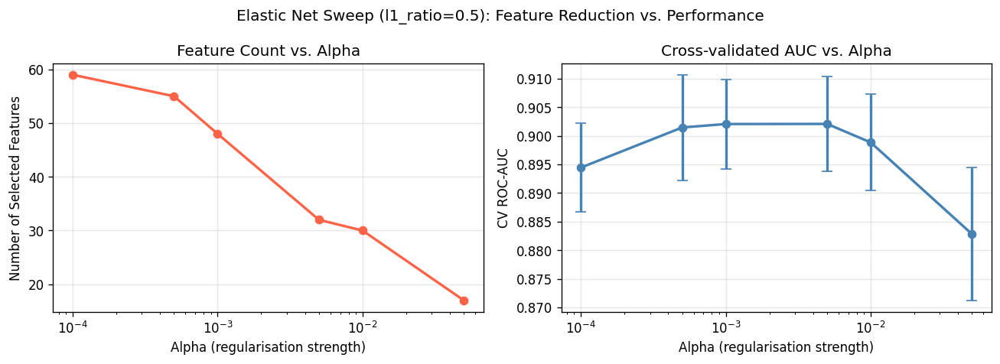
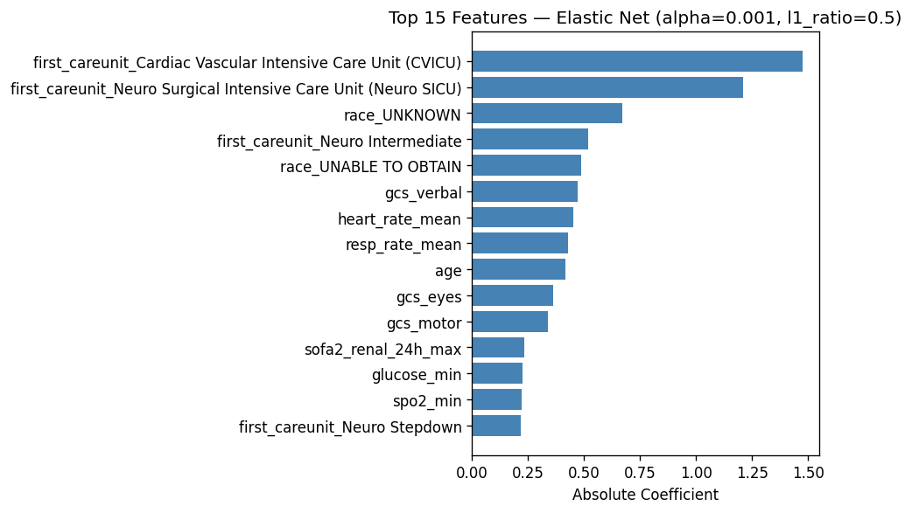

# ICU Discharge Prediction using MIMIC-IV

Predicting whether an ICU patient will be discharged or die, using real clinical EHR data from the MIMIC-IV database and a three-stage machine learning pipeline.

**Best model: Random Forest - ROC-AUC 0.909, F1 0.934**

---

## Project Overview

ICU bed allocation is one of the most resource-intensive decisions in hospital management. Premature discharge risks patient deterioration; delayed discharge wastes critical resources. This project builds and compares machine learning models to predict ICU discharge outcomes using structured clinical data.

**Clinical question:** Can we predict whether an ICU patient will be discharged alive, using data available at the time of admission?

---

## Dataset

- **Source:** [MIMIC-IV](https://physionet.org/content/mimiciv/), a de-identified EHR database from Beth Israel Deaconess Medical Center, Boston
- **Size:** 65,000+ ICU patient records
- **Target variable:** `icu_discharge_flag` (1 = discharged alive, 0 = died in ICU)
- **Class distribution:** ~91% discharged, ~9% died (imbalanced)

---

## Pipeline

```
Raw Data (131 features)
        ↓
Preprocessing: imputation, scaling, one-hot encoding → 223 features
        ↓
Stage 1 - Missingness filter (>60% missing removed) → 137 features
        ↓
Stage 2 - Near-zero variance filter → 79 features
        ↓
Stage 3 - High correlation filter (|r| > 0.95) → 69 features
        ↓
Elastic Net embedded selection (alpha sweep) → 30 features
        ↓
5 Models trained and compared
```

---

## Feature Selection: Why Elastic Net?

Standard LASSO (L1) arbitrarily drops one variable from correlated pairs - a problem in clinical data where variables like `sbp_min`, `sbp_max`, and `sbp_mean` are correlated but all clinically meaningful.

Elastic Net combines L1 (sparsity) + L2 (grouping effect), retaining correlated clinical variables together. An alpha sweep across 6 values selected **α = 0.01**, reducing 69 → 30 features while maintaining AUC within 0.005 of maximum.

**Top selected features:** ICU unit type (CVICU, Neuro SICU), GCS subscores (verbal, eyes, motor), mean heart rate, mean respiratory rate, age, renal SOFA score, minimum glucose, minimum SpO₂

---

## Models & Results

| Model | Accuracy | Precision | Recall | F1 | ROC-AUC |
|---|---|---|---|---|---|
| Random Forest | 0.884 | 0.970 | 0.901 | **0.934** | **0.909** |
| Logistic Regression | 0.837 | 0.978 | 0.840 | 0.904 | 0.906 |
| SVM (RBF) | 0.869 | 0.975 | 0.880 | 0.925 | 0.904 |
| Decision Tree | 0.782 | 0.977 | 0.780 | 0.867 | 0.868 |
| Linear Regression* | 0.927 | 0.927 | 0.998 | 0.961 | 0.897 |

*Linear Regression F1 is inflated due to threshold behaviour - ROC-AUC is the appropriate metric here

All models trained on 80% split, evaluated on stratified 20% hold-out. Class imbalance handled via `class_weight='balanced'` (no synthetic oversampling).

---

## Key Findings

- **Random Forest** achieved the best AUC (0.909) and F1 (0.934), capturing non-linear interactions between GCS scores, respiratory rate, and ICU unit type
- **Feature selection reduced dimensionality by 87%** (223 → 30) with no meaningful loss in predictive performance
- **False positives are the critical error** in this context - predicting discharge for a patient who dies is clinically dangerous. Logistic Regression produced the fewest (228 vs Random Forest's 337), highlighting the importance of threshold calibration before any clinical deployment
- Race variables (race_UNKNOWN, race_UNABLE TO OBTAIN) were selected by Elastic Net - likely capturing documentation patterns rather than biological signal, raising fairness and generalisability concerns

---

## Visualisations

| ROC Curves | Confusion Matrices |
|---|---|
|  |  |

| Elastic Net Sweep | Feature Importance |
|---|---|
|  |  |

---

## Repository Structure

```
├── elastic_net_pipeline_github.py   # Full ML pipeline
├── outputs_en/                      # Generated plots and results
│   ├── roc_curves_en.png
│   ├── confusion_matrices_en.png
│   ├── en_sweep.png
│   ├── en_coefficients.png
│   └── model_results_en.csv
├── requirements.txt
└── README.md
```

---

## How to Run

```bash
# 1. Clone the repo
git clone https://github.com/ayeshamehra/icu-discharge-prediction-mimic.git
cd icu-discharge-prediction-mimic

# 2. Install dependencies
pip install -r requirements.txt

# 3. Add your MIMIC-IV dataset
# Place 'Assignment1_mimic dataset.csv' in the root directory
# Access requires credentialed PhysioNet account: https://physionet.org/

# 4. Run the pipeline
python elastic_net_pipeline_github.py
```

> **Note:** MIMIC-IV access requires completing CITI training and signing a data use agreement via [PhysioNet](https://physionet.org/content/mimiciv/). The dataset is not included in this repository.

---

## Future Work

- Temporal modelling using longitudinal patient trajectories (time-series vitals)
- Probability calibration (Platt scaling / isotonic regression) for clinical deployment
- Gradient boosting (XGBoost/LightGBM) comparison
- SHAP values for individual patient explainability
- PostgreSQL integration for scalable data querying

---

## References

1. Johnson et al. (2024). MIMIC-IV (version 3.1). PhysioNet. https://doi.org/10.13026/kpb9-mt58
2. Tibshirani, R. (1996). Regression Shrinkage and Selection via the Lasso. JRSS-B, 58(1), 267–288.
3. Zou, H. & Hastie, T. (2005). Regularization and Variable Selection via the Elastic Net. JRSS-B, 67(2), 301–320.

---

*Data source: MIMIC-IV - de-identified clinical data. Access requires credentialed PhysioNet account.*
